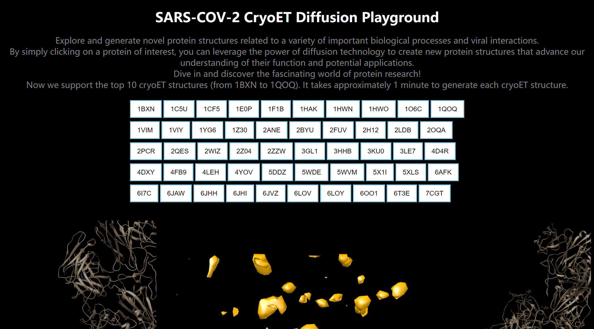
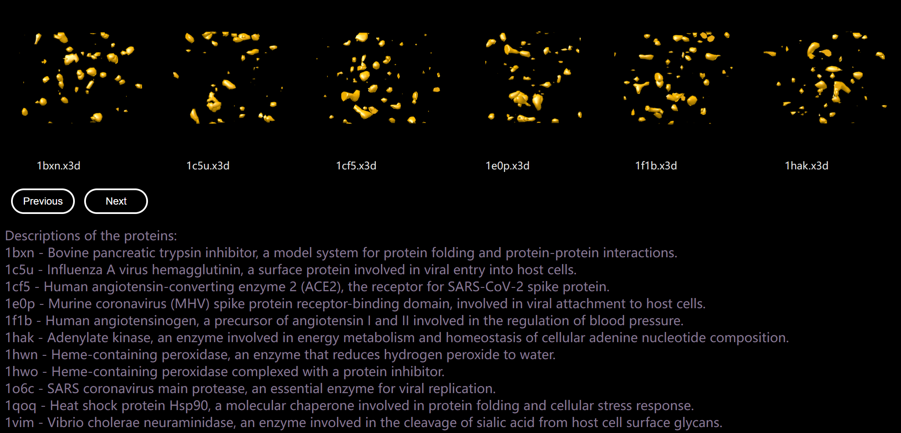

# Cryo-ET 3D Diffusion

## Requirement
- pytorch
- flask (for web)
- chimera (for x3d visualization)
----
## Installing UCSF Chimera on Linux from Source Code

## Step 1: Download the source code
<details>
First, download the latest version of the Chimera source code from the official website:

[UCSF Chimera Source Download](https://www.cgl.ucsf.edu/chimera/download.html)

Select the appropriate source code package for your system (e.g., `chimera-1.15-src.tar.gz`) and download it.
</details>

## Step 2: Install dependencies
<details>
Chimera requires several dependencies to be installed on your system. Install them using the following commands:

For Debian/Ubuntu based systems:

```bash
sudo apt-get update
sudo apt-get install -y build-essential python3-dev libx11-dev libglu1-mesa-dev libxi-dev libxmu-dev libfreetype6-dev libjpeg-dev libtiff-dev libfftw3-dev libcairo2-dev libssl-dev libldap2-dev libboost-python-dev libboost-thread-dev libboost-filesystem-dev libboost-iostreams-dev libboost-regex-dev
```
For RHEL/CentOS based systems:
```
sudo yum groupinstall "Development Tools"
sudo yum install -y python3-devel libX11-devel mesa-libGLU-devel libXi-devel libXmu-devel freetype-devel libjpeg-turbo-devel libtiff-devel fftw-devel cairo-devel openssl-devel openldap-devel boost-python3-devel boost-thread-devel boost-filesystem-devel boost-iostreams-devel boost-regex-devel
```
</details>

## Step 3: Extract and build Chimera
<details>
Extract the downloaded source code package and enter the extracted directory:
```
tar -xzf chimera-1.15-src.tar.gz
cd chimera-1.15-src
```
Configure and build Chimera:
```
./configure
make
```
</details>

## Step 4: Install Chimera
<details>
After the build process is complete, install Chimera on your system:
```
sudo make install
```
Now, Chimera should be installed on your system. You can run it with the chimera command.
</details>

## Step 5: Set up the environment
<details>
It is recommended to add the Chimera executable to your `PATH` environment variable for easier access. Find the installation path of Chimera (usually `/usr/local/chimera`) and add it to your `PATH`:

```bash
echo 'export PATH=$PATH:/usr/local/chimera/bin' >> ~/.bashrc
source ~/.bashrc
```

Replace /usr/local/chimera with the actual installation path if it is different on your system.
</details>

## Step 6: Test Chimera installation
<details>
To ensure that Chimera has been installed correctly, you can run the following command:

```
chimera --version
```
This should display the installed version of Chimera.
</details>

----
## Dataset Preparation
To preprocess the CryoET dataset, follow these steps:

1. Place your raw MRC files in a folder structure like the following:
```
dataset/
    class1/
        subtomogram_mrc/
            tomotarget0.mrc
            tomotarget1.mrc
            ...
    class2/
        subtomogram_mrc/
            tomotarget0.mrc
            tomotarget1.mrc
            ...
```
2.Update the CryoETDataset class in dataset.py to read from your dataset folder.

3.Modify the normalization and inverse normalization functions to match the specific requirements of your dataset.

## Training
To train the model, run the following command:
```
python train.py
```
```python
defaults = dict(
        learning_rate=2e-4,
        batch_size=6,  # Adjust this if needed
        iterations=400000,  # Adjust this if needed

        log_to_wandb=False,
        log_rate=10000,
        checkpoint_rate=10000,
        log_dir="logs",
        project_name="ddpm",
        run_name=run_name,
        root_dir = "/home/flask-diffusion/cryoet/DDPM/cryoet_dataset/SNR001",
        train_num = 10,

        model_checkpoint=None,
        optim_checkpoint=None,

        schedule_low=1e-4,
        schedule_high=0.02,

        device=device,
    )
```
please check ```create_argparser()``` to set configuration.


It takes about 4 days to train 10 classes on 6 RTX3090.

## Sampling
```
python sample_image.py
```
## WEB
```
python app.py
```
You can engage with and view the 3D object on the web.




# Reference
```
@article{zeng2019aitom,
  title={AITom: Open-source AI platform for cryo-electron Tomography data analysis},
  author={Zeng, Xiangrui and Xu, Min},
  journal={arXiv preprint arXiv:1911.03044},
  year={2019}
}
```
